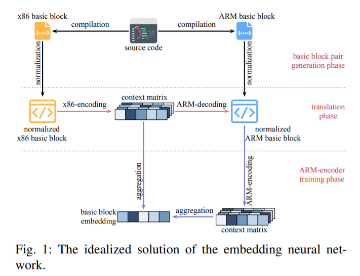
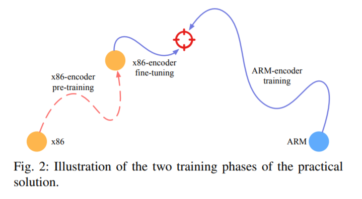
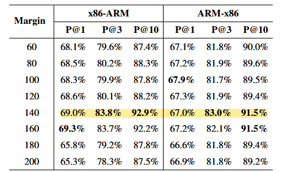
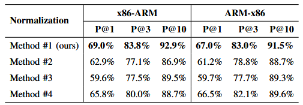
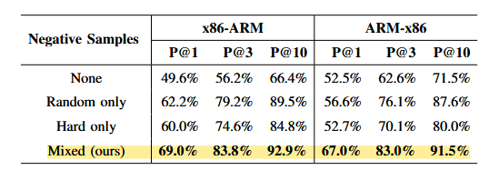

### 研究背景与动机

  * **基本块相似性分析的重要性** ：在许多机器学习基础的二进制程序分析方法中，基本块相似性分析是一项关键技术。它广泛应用于漏洞检测、恶意软件分类和作者分析等领域，是二进制程序相似性度量的基础。
  * **现有方法的局限性** ：
    * **语义信息有限** ：传统方法通过手动选择特征将基本块映射到固定维度向量，但这些整数表示的特征不是连续的，包含的信息量有限。
    * **仅适用于单一 ISA** ：基于静态词表示的方法虽提高了信息容量，但不适用于跨 ISA 基本块嵌入。因为不同 ISA 的 token 无法出现在相同上下文中，违背了分布表示假设，导致无法将不同 架构的基本块映射到同一嵌入向量空间。
    * 在此之前，能进行跨架构基本块比较的方法有INNEREYE-BB，但是其标准化方法存在着一些问题。 作者指出，在采用RNN这种架构的神经网络时，需要输入前一隐状态，但是经过统计发现，大多数基本块的结尾是以跳转其他基本块标签或函数名结束。

        ht,ct=FLSTM(st,ht−1,ct−1)ht,ct=FLSTM(st,ht−1,ct−1)

     但是再INNEREYE中的标准化步骤将所有的函数名和基本块标签名给用统一的符号代替，这样就使得在计算最后的输出时，输入的snsn是一样的。

### 研究方法

  * **利用 NMT 模型** ：
  * 
    * **模型理想化构建** ：对于一对语义等价的跨架构基本块，首先使用x86-encoder(Transformer encoder)得到x86基本块的上下文矩阵C，再使用ARM-decoder(Transformer decoder)，就可以得到相同的ARM基本块，再使用ARM-encoder生成ARM的上下文矩阵。对上下文矩阵进行求和，就可以得到这个基本块的embedding E，根据此embedding就可以完美的计算跨架构指令集基本块之间的相似性。 但是，构建出类似这样的矩阵十分困难，所以作者想出了更加实际的解决办法。
    * **模型选择** ：考虑到 Transformer 架构在 NMT 任务中的优势，如高度并行的自注意力机制，使其在计算效率和翻译质量上表现出色，因此选择 Transformer 架构作为 NMT 模型。
 
  * **数据预处理与基本块对生成** ：
    * **指令归一化方法** ：提出了一种新的指令归一化方法，将常量分为立即数、地址、变量名、函数名和基本块标签五类并进行符号化表示，寄存器按类别归一化。
    * 对于x86寄存器：划分到14类：指针寄存器、浮点数寄存器、4类通用寄存器、4类数据寄存器、4类地址寄存器。其中的每一小类是根据所存储的数据长度来划分：8、16、32、64位。
    * 对于ARM寄存器：划分为两类：通用寄存器和指针寄存器。
    * **基本块对生成** ：即pre-training的部分。为训练模型，提出了 x86 - ARM 基本块对的生成方法，通过在 LLVM 中集成一个传递来标记基本块，根据输入的x86代码，将其反映成与之基本块相近的ARM架构，然后：对于 x86基本块列表 S=(s1​,…,sk​)ARM 基本块序列 T 的前一部分 T=(t1​,…,tk−1​)，模型的目标是预测下一个 token tk​ 的概率分布并计算与真实值之间的损失.

  * **负样本生成** ：
    * 仅使用正样本（语义等价的基本块对）会导致模型将任意输入映射到相同向量，无法有效区分不同语义的基本块。
    * **方法** ：提出了结合难负样本和随机负样本。正样本是语义相同的x86和ARM基本对，选择与正样本在欧几里得距离上较近但语义不同的基本块作为难负样本。同时随机选择部分负样本，以确保训练的稳定性。

  * **嵌入网络训练** ：采用基于边距的三元组损失函数，公式如下：

        L=max{D(E1,E2)−D(E1,E3)+γ,0}

     其中，E1、E2 和 E3 分别是锚点、正样本和负样本的嵌入向量，γ 是边距参数，D 表示欧几里得距离。该损失函数确保正样本与锚点的距离小于负样本与锚点的距离至少为 γ。

### 实验与结果

  * **数据集与评估指标** ：构建了一个名为 MISA 的大规模数据集，包含超过一百万 x86 - ARM 基本块对，来自五个不同领域的知名 C/C++ 开源项目。采用精确度（P@N）作为评估指标，衡量在给定基本块的情况下，其语义等价基本块在排序结果中的排名位置。
  * **超参数选择** ：通过实验确定三元组损失函数中的边距值为 140 时，模型在验证集上的表现最佳。过大或过小的边距都会导致模型性能下降，过大使训练任务过于困难，易过拟合；过小则使训练任务过于简单，无法有效区分不同语义的基本块。
  * 
  * **与其他方法比较** ：与基线方法 INNEREYE - BB 相比，MIRROR 在所有指标上均显著优于基线方法。在训练数据较多时，MIRROR 的 P@1 指标在 x86 - ARM 和 ARM - x86 任务上分别比基线方法高至少 14% 和 40% 以上。即使在训练数据较少（仅为基线方法训练数据的 10%）的情况下，MIRROR 的性能也优于基线方法。
  * **指令归一化方法比较** ：将提出的归一化方法与另外三种方法进行比较，结果表明在所有六个指标上，提出的归一化方法均优于其他三种方法。这证明了该方法在保留语义信息和提高模型性能方面的有效性。
  * * 
  * **负样本方法比较** ：对四种不同的负样本生成方法进行比较，包括不使用负样本、仅使用随机负样本、仅使用难负样本和所提出的混合方法（难负样本与随机负样本结合）。实验结果表明，所提出的混合方法在所有指标上表现最好，仅使用难负样本的方法并不优于仅使用随机负样本或混合方法，验证了所提出负样本生成方法的有效性。
  * * 
  * **预训练的重要性** ：通过对比预训练和非预训练模型，发现预训练模型在所有指标上优于非预训练模型，无论是在仅使用随机负样本还是混合负样本的情况下。这说明预训练阶段对于提高模型性能具有重要意义。

### 研究结论

文章提出的跨 ISA 二进制基本块相似性度量方法 MIRROR，在基本块相似性度量的准确性以及基本块嵌入质量方面，大幅优于当前最先进的方法。预训练、指令归一化方法和负样本生成方法均有效提升了模型性能。此外，构建的大规模数据集 MISA 为该领域的研究提供了基准。

### 研究局限性

尽管 MIRROR 在基本块相似性度量方面取得了很好的结果，但尚未在程序相似性分析任务上进行测试，因为一些先前的研究尚未开源。未来的工作将重点关注这些局限性，进一步完善方法并拓展其应用场景。