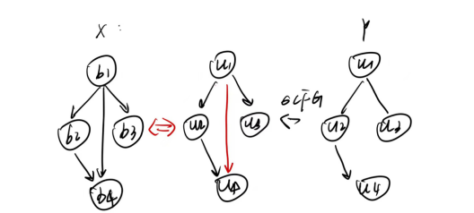

**Improving ML-based Binary Function Similarity Detection by Assessing and  Deprioritizing Control Flow Graph Features**

BFSD通常将CFG作为重要特征，因为CFG能够描述函数内部基本代码块之间的控制依赖关系。然而，CFG在模型决策中的过度依赖可能会影响语义的学习。

## Explainer

首先需要验证CFG特征的重要性

作者提出的方法是局部基于近似的方法explainer。就为何使用这种方法，首先该方法能探测CFG重要性分数，其次这种方法和检测的模型无关以探测所有的模型。

解释模块explainer主要由特征规范和局部近似两个部分。

**1 特征规范**

对于语义特征部分，将二进制代码转化成汇编指令，（因为直接分析操作数操作码的组合列举指令对于语义的理解比较困难），所以将指令分类成包括调用、跳转、算数、数据传输以及其他五个特征并且计算语义分数；而对于CFG特征包括节点和边的数量以及图之间的相似性（考虑到存在节点和边数量相同但是结构不同的两个图）。

**2 局部相似**

在生成局部实例部分，通过删除语义指令特征的方式来影响CFG的就够（如CFG的边和节点）形成新的数据，并且计算新的函数和旧的之间的相似度。并且在生成每个局部实例时，设定一个阈值来限制扰动的程度，确保生成的实例仍在的邻域内

将上述二者结合，能够计算出模型对CFG特征的依赖程度，从而解释ML-BFSD的模型决策过程。

**实验结果：

作者将这种的解释方法应用于11种先进的ML-BFSD解决方案，包括使用CFG的Genius、Asm2Vec、Gemini等，以及未使用CFG的Safe、Trex和jTrans。实验的评估指标是统计 Top-1 率 （分别统计在所有函数中，语义特征或 CFG 特征的得分最高的函数数量占总函数数量的比例）。发现CFG特征的重要性远高于其他特征。在DEXTER中，根据LIME，CFG特征的分数为0.163，而Call、Jump等语义特征的分数均低于此。

## δCFG

为了解决这种过度依赖的问题，作者提出了δCFG解决方案，用于操纵CFG以评估和降低模型对CFG特征的依赖。δCFG包含基本块匹配算法和边匹配算法，能够在保留函数语义的同时，使函数对的CFG相同或不同。

假设有两个函数 x 和 y，它们的 CFG 不同。δCFG 会如下操作：

l*基本块匹配：从 x 和 y 的入口块开始，将它们匹配在一起

l BFS 匹配：使用 BFS 策略匹配剩下的基本块。例如，对于 x 中的一个基本块 b1，其直接后继有 b2 和 b3，而在 y 中与 b1 匹配的基本块 u1 的直接后继有 u2 和 u3，δCFG 会将 b2 匹配到 u2，b3 匹配到 u3。

l 边匹配：检查每个基本块的直接后继是否在两个函数中都有对应的边。如果没有，δCFG 会添加相应的边。例如，如果 x 中 b1 有一个到 b4 的边，而 y 中 u1 没有到 u4 的边，δCFG 会添加这个边，并修改分支条件以保持语义不变。

l 添加空基本块：如果 x 的基本块数量多于 y，δCFG 可能在 y 中添加空基本块以确保数量匹配。

**实验结果：

作者提出了四个问题，并且逐一进行了实验解答
#### RQ1
**What is the impact on model decisions when a pair of functions with identical CFGs are modified to have different CFGs?（相同的控制流图改成不同的，语义不变）**

**实验设置**：

- 对于每个 ML-BFSD 解决方案 F，随机选择 5,000 个具有相同 CFG 和语义的函数对，记为 <x, x2>。

- 通过 δCFG 操纵这些函数对，使其 CFGs 不同，同时保持语义不变。

- 两个评估指标：
  - **相似度分数减少比例 (Decrease Ratio)**: 计算相似度分数减少的比例，即 。

  - **错误率 (Error Rate, ER)**: 在不同的函数池大小（16, 32, 64, 128）下，评估模型是否仍然能够正确识别 x' 和 x2 的相似性。

**结果**：

- 对于依赖 CFG 的解决方案，大部分函数对的相似度分数减少了 40% 至 60% 或更多。

- 随着池大小增加，错误率显著增加。即使是在较小的函数池16中，大多数解决方案的错误率仍然超过 40%，

- 不依赖 CFG 的解决方案（如 SAFE, Trex, jTrans）表现出较低的减少比例和错误率，这些解决方案对 CFG 的依赖较弱。

#### RQ2
**What is the impact on model decisions when a pair of functions with different CFGs are modified to have identical CFGs?（不同的控制流图改成相同的，语义不变）**

**实验设置**：

- 对于每个解决方案 F，随机选择 5,000 个具有不同语义的函数对 <x, y>。

- 通过 δCFG 操纵这些函数对，使其 CFGs 相同，同时保持语义不变。

- 三个指标评估：

  - **相似度分数增加比例 (Increase Ratio)**: 计算相似度分数增加的比例，即 。

  - **错误率 (ER)**: 在不同的函数池大小下，评估模型是否错误地将 x' 和 y' 识别为相似。

  - **Top-1 率**: 评估在函数池中，x' 和 y' 的相似度分数是否排名第一的比例。

**结果**：

- 对于依赖 CFG 的解决方案，大部分函数对的相似度分数显著增加，超过 40% 的函数对增加比例超过 40%，至少 42.4% 超过 60%。

- 在较小的函数池（如 16）中，大多数解决方案的错误率超过 50%，随着池大小增加到 128，错误率超过 70%。

- 在所有解决方案中，Top-1 率在池大小为 128 时仍然超过 20%。不依赖 CFG 的解决方案（如 SAFE, Trex, jTrans）表现较为稳定，依赖性较低。

#### RQ3
**How come these ML-BFSD solutions rely heavily on CFGs?（原因分析）**

- **设计缺陷**：许多 ML-BFSD 解决方案在设计上存在缺陷，导致语义学习不足。例如，Gemini等方法手动指定特征，导致信息丢失；Genius等一些方法未能充分捕捉指令间的关系，只考虑块内不考虑块间的特征。

- **训练集偏差**：训练集中的函数对分布存在偏差，导致模型过度依赖 CFG 特征。训练集中具有相同 CFG 而语义不同的类型数量极少；这种偏差导致模型倾向于将相同 CFG 的函数对识别为语义相同从而导致对于CFG的依赖性。

#### RQ4
**Can our δCFG be utilized to mitigate the overreliance and enhance the performance of ML-BFSD solutions?（如何减轻对CFG的过度依赖）**

**实验设置**：

- 因为无法针对每一个模型进行修改，但可以主要针对训练集的偏差，使用 δCFG 生成具有相同 CFG 但不同语义的函数对，以增加训练集的多样性，从而减轻对CFG的依赖

**结果**：

通过解释方法验证，数据增强后的模型对语义特征的重要性评分提高，对 CFG 特征的重要性评分降低，表明模型对 CFG 特征的过度依赖得到了缓解。

## 研究贡献与意义

本文的贡献在于：

1. 首次系统性地评估了CFG特征在ML-BFSD中的作用，揭示了现有模型对CFG特征的过度依赖。

2. 提出了δCFG解决方案，用于操纵CFG以评估和降低模型对CFG特征的依赖。

3. 通过数据增强和模型微调，显著提升了现有ML-BFSD解决方案的性能和鲁棒性。

该研究对于二进制分析领域的研究者和实践者具有重要的启示意义，有助于开发更可靠、更鲁棒的ML-BFSD解决方案，推动软件安全技术的发展。

## 研究局限与未来展望

尽管本文取得了显著成果，但仍存在一些局限性。例如，δCFG解决方案的自动化程度和适用范围可能需要进一步扩展，以应对更复杂的实际场景。未来的研究可以探索更多CFG特征与其他语义特征的融合方法，进一步提升模型的性能和泛化能力。

总的来说，本文通过深入分析CFG特征在ML-BFSD中的作用，提出了有效的解决方案来降低模型对CFG特征的过度依赖，为二进制函数相似性检测领域的研究提供了新的方向和方法。