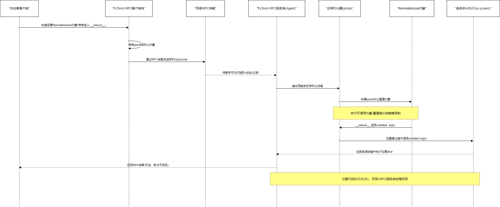
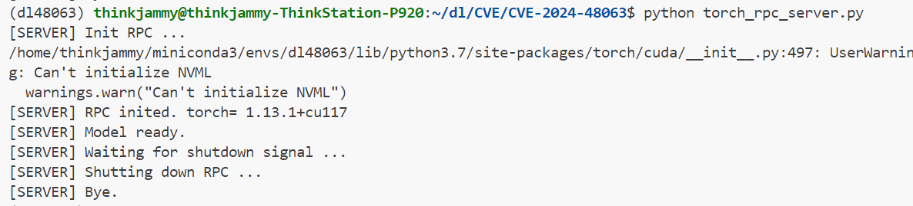
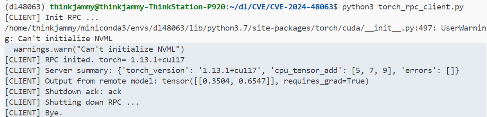

# CVE-2024-48063: PyTorch 分布式RPC框架反序列化漏洞分析

## 漏洞概述

根据共享文档，PyTorch 的分布式RPC框架中存在一个反序列化漏洞（CVE-2024-48063）。

PyTorch 2.4.1及之前版本的分布式RPC框架中存在反序列化漏洞，由于RemoteModule在反序列化过程中没有适当地验证或清理输入数据，导致攻击者可以通过客户端将包含恶意方法的RemoteModule实例序列化为数据，并通过RPC框架发送到服务器触发反序列化，从而可能导致在服务器上远程执行任意命令。

## 攻击流程图

根据理解画了流程图：

## 实验环境构建

### 1. 客户端构建

### 2. 服务器端构建

## 漏洞原理分析

### 反序列化执行链

反序列化执行链的关键点在于当服务端使用通用 `pickle.loads()` 反序列化来自客户端的对象时，会执行对象中定义的 `__reduce__()` 方法。

### 攻击路径

在实际攻击场景中，PyTorch RPC 服务端在处理 RemoteModule 等分布式对象时，如果未做反序列化限制，则攻击者会根据以下攻击路径：

**客户端 → RPC 消息 → 服务端反序列化 → 执行任意命令**

## 影响范围

- **受影响版本：** PyTorch 2.4.1及之前版本
- **影响组件：** 分布式RPC框架
- **风险等级：** 高危（可能导致远程代码执行）

## 防护建议

1. **及时更新：** 升级到PyTorch 2.4.1之后的版本
2. **输入验证：** 对RPC消息进行严格的输入验证
3. **反序列化限制：** 限制pickle反序列化的对象类型
4. **网络安全：** 确保RPC服务端仅接受可信客户端的连接