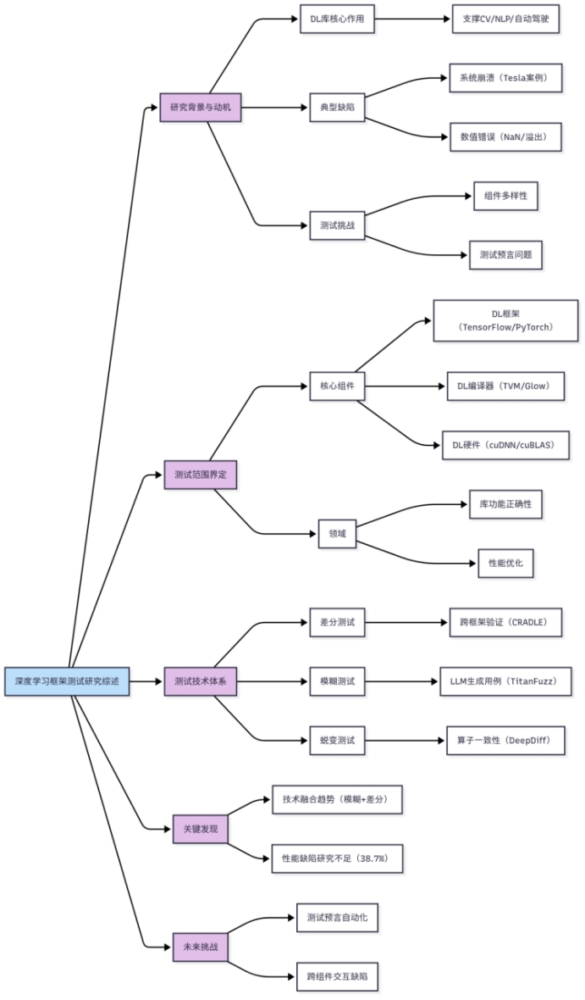

文章是今年新的较为全面的综述总结，根据文章思路我绘制了流程图，主要从下面几个方面进行了学习：

### 1. 研究背景与动机

深度学习（DL）技术已在计算机视觉、自然语言处理、自动驾驶等领域广泛应用，而深度学习库（如TensorFlow、PyTorch）是支撑这些系统的核心基础设施。然而，与传统软件类似，深度学习库也存在缺陷（bugs），这些缺陷可能导致：

l  系统崩溃（Tesla自动驾驶系统因PyTorch缺陷导致异常行为）。

l  数值错误（计算结果不一致或NaN溢出）。

l  性能下降（GPU内存泄漏或计算效率低下）。

由于深度学习库的复杂性和快速迭代，其测试面临独特挑战：

1. 多样性：DL库包含framework、编译器、hardware library等多个组件，各自功能与测试需求不同。

2. 测试预言（Oracle）问题：许多DL操作（如梯度计算）缺乏明确的正确性标准。

3. 演化迅速：新算子和优化技术不断引入，测试方法需持续适应。

4. 功能性

    状态缺陷：崩溃、异常（如`Segmentation Fault`）。

    数值缺陷：输出不一致、NaN/Inf溢出。

    优化缺陷（编译器特有）：错误优化导致语义变化（如误删有效代码）。

5. 性能

    时间/内存开销异常（如GPU利用率低）。

本文首次系统梳理了DL库测试的研究进展，提出分类框架，并分析未来挑战。

### 2. 深度学习库的组成与测试范围
#### 2.1 三类核心组件

|   |   |   |   |
|---|---|---|---|
||功能|代表工具|重点|
|DL framework|提供高层API，用于构建和训练模型（如神经网络层、优化器）|TensorFlow, PyTorch|API的正确性，数值的稳定性|
|DL compiler|将模型转换为硬件优化的中间表示和算子。|TVM, Glow|优化正确性、语义一致性|
|DL hardware library|在特定硬件（GPU/TPU）上进行卷积矩阵乘法等高效运算|cuDNN, cuBLAS|计算精度、硬件兼容性、性能瓶颈。|

####  2.2 测试范围界定

作者发现现有的研究主要是测试和发现错误，很少有研究安全漏洞和弱点的作品。因此给出了如下的范围鉴定.

 界定的范围不包括：DL模型测试（如对抗鲁棒性）、DL程序测试（用户代码错误）。（作者解释前者旨在发现和修复DL程序中的错误，而不是程序调用的DL库中的错误，而后者则侧重于DL模型本身的安全属性和问题。）

 聚焦：DL库自身的功能正确性和如内存/时间开销的性能问题。

###  3. 测试属性与技术分类

#### 3.1 测试属性

1. 功能性

    状态缺陷：崩溃、异常（如`Segmentation Fault`）。

    数值缺陷：输出不一致、NaN/Inf溢出。

    优化缺陷（编译器特有）：错误优化导致语义变化（如误删有效代码）。

2. 性能

    时间/内存开销异常（如GPU利用率低）。

####  3.2 主要测试技术

|   |   |   |   |
|---|---|---|---|
|主要技术|原理|使用场景|典型工具|
|Differential testing|比较同一输入在不同实现或设备的输出差异，例如PyTorch vs TensorFlow, CPU vs GPU|跨框架/设备验证|CRADLE, Muffin|
|Fuzzing testing|通过生成随机或不规则的数据输入探索边界|尽可能多地覆盖代码的各个部分|FreeFuzz ，TitanFuzz|
|Metamorphic testing|设计输入变换的蜕变关系，验证功能一致性（如conv(x)应与conv(x.T)相关）|复杂算子验证|DeepDiff|

###  4. 各组件测试方法

#### 4.1 DLframework测试

###### 4.1.1 常见缺陷类型

1、API误用，如参数类型不匹配。2、多语言接口问题，Python/C++交互错误。3、数值不稳定，如梯度爆炸。

######  4.1.2 差分测试方法

 模型级：通过变异模型结构（如增减层）触发框架差异（如CRADLE）。

 API级：直接比较API行为（torch.matmul vs. tf.linalg.matmul）。

 这种方法的误报率高。

###### 4.1.3 模糊测试方法

 生成式：从文档或代码中提取约束生成输入（如DocTer）。

 变异式：基于种子输入突变（如FreeFuzz）。

 LLM赋能：TitanFuzz用Codex生成边缘用例，覆盖3413个API。

#####  4.2 DLcompiler测试

###### 4.2.1 关键挑战

测试输入需满足编译器IR的语法和类型规则。（文章提出，DLcompiler测试集中在三个容易出现bug的阶段）

###### 4.2.2 测试方法

 模糊测试：NNSmith  生成合法计算图；Tzer 通过覆盖率引导变异IR。

 蜕变测试：设计MRs验证优化等价性（如插入零值算子不应改变结果）。

##### 4.3 DLhardware library测试(现状缺乏系统性缺陷检测工具)。

### 5. 实验对比与发现

#### 5.1 DLframework测试工具对比

|   |   |   |   |   |
|---|---|---|---|---|
|工具|技术|覆盖API数|测试缺陷数目|Advantage|
|Muffin|差分测试（模型级）|52|39|定位缺陷层|
|FreeFuzz|模糊+差分|1158|49|开源代码复用|
|TitanFuzz|LLM生成+变异|3413|108|高覆盖率，支持边缘用例|

#### 5.2 DLcompiler测试工具对比

 Tzer：覆盖26k代码行，发现49个TVM缺陷。

 GenCoG：通过DSL生成合法测试用例，支持62个算子。

### 6. 关键发现与挑战

#### 6.1 主要发现

1. 技术融合趋势：结合模糊测试（生成输入）与差分测试（验证输出）效果最佳。

2. 性能缺陷研究不足：仅38.7%论文涉及性能测试，且缺乏定量分析。

3. 安全漏洞探索少：现有工作多关注功能缺陷，忽视内存泄漏等安全问题。

#### 6.2 未来挑战

1. 如何为复杂算子（如自动微分）设计通用MRs？

2. 如何联合测试框架编译器硬件库的交互缺陷？

3. 如何适应DL库快速迭代（如PyTorch 2.0新特性）？

4. 需构建包含多样化缺陷的标准化测试集。