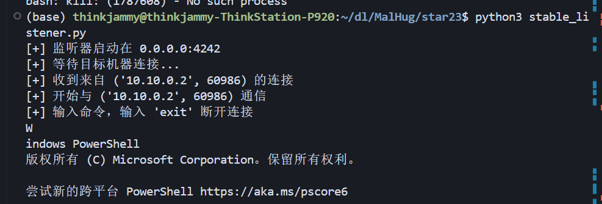

# MalHug: Models Are Codes - 恶意模型检测研究

## 研究概述

在读论文之前很好奇为什么论文的命名是以"models are codes"这么一个新颖的标题，读完全文后个人理解为文章的核心在于强调预训练模型本质上也是可执行代码，而不仅仅是静态的数据或参数集合。

在之前我也一直认为模型是和数据集一样的静态数据，如权重参数、架构描述，而代码是用于训练或推理的脚本；但是现实中许多模型序列化格式（如文中的Pickle、Keras HDF5）允许在模型文件中嵌入可执行代码。那么在代码运行当中就可能存在脆弱点和漏洞，存在容易被忽视的安全隐患。

这种"models are codes"改变了对模型的认知，从而也引起读者对模型这一领域安全问题的重视。

## 研究背景与动机

随着PTMs和LLMs的广泛应用，Hugging Face等model hubs成为集中存储和共享模型与数据集的重要平台。然而，他们的开放性使其成为恶意攻击的高价值目标。近年来，安全报告揭示了Hugging Face平台中的漏洞和恶意攻击事件，例如通过模型或数据集加载脚本注入恶意代码的攻击。这些攻击可能导致后门安装、敏感信息窃取或勒索软件部署等严重后果。

## 研究空白

如Fickling、ModelScan的防御工具主要依赖检测特定库和函数调用，但是不执行代码，这样缺乏对实际执行代码的语义级分析，难以应对复杂或混淆的攻击。

此外，目前对PTM供应链中的攻击技术和滥用行为的全面理解仍存在空白。

## 研究贡献

1. **提出并实现了一个端到端的检测管道MalHug**，结合数据集加载脚本提取、模型反序列化、深度污点分析和启发式模式匹配几种方法，能够更精准地检测和分类恶意模型与数据集。

2. **MalHug在蚂蚁集团的Hugging Face镜像实例中部署并运行超过三个月**，监测了超过70.5万个模型和17.6万个数据集，发现了91个恶意模型和9个恶意数据集加载脚本，揭示了包括反向Shell、浏览器凭证窃取和系统侦察等多种安全威胁。

## 关键技术

关键技术主要分为四个部分：

### 1. 数据集加载脚本分析
通过静态分析识别危险库和API调用，如`eval`、`os.system`，发现其实很多都是非常常用的库和脚本。

### 2. 模型文件分析
为了发现文件中潜在的恶意代码或可疑操作，为每个非常主流的框架如pytorch和tensorflow进行了详细的处理：

- **PyTorch/Pickle**：pytorch文件和pickle通常保存于`.pt`、`.pkl`的文件下，阅读起来十分困难，通过反编译Pickle文件，识别危险操作码（如`REDUCE`、`GLOBAL`）进一步生成AST结构，结合上下文判断是否有恶意代码进而深度揭示隐藏的恶意逻辑

- **TensorFlow/Keras模型**：这两个模型主要对应savemodel和hdf5两种格式，因为Keras允许通过Lambda层嵌入任意Python函数，因此攻击者可利用此特性注入恶意代码；而对于tensorflow中的操作符，作者指出"we do not perform further analysis beyond identification."对于该原因我进行了资料的查询，由于TensorFlow操作符本身不具备直接执行恶意代码的能力，且无法像Lambda层那样被反编译分析，因此作者选择"识别但不深入分析"。

### 3. 污点分析
基于Scarpel框架构建了CFG和DFG，并且构建源接收器对（如`os.environ`为源，`requests.get`为接收器）用于追踪敏感数据流。

### 4. 启发式模式匹配
如果仅靠API级别的污点分析，如"是否调用了subprocess.run"无法覆盖所有攻击方式。作者提出使用YARA规则补充污点分析，检测恶意Shell命令或混淆代码。

## 实验结果

### 恶意行为分类
识别出远程控制（如反向Shell）、敏感信息窃取（如Chrome凭证窃取）和概念验证攻击等恶意行为。

### 与现有工具对比
MalHug在语义级分析和数据集脚本检测方面优于现有工具（如PickleScan、ModelScan）。

### 具体攻击案例

1. **远程控制**：模型`baller10`注入反向Shell代码，连接攻击者服务器。
2. **信息窃取**：模型`Besthpz/best`窃取浏览器密码和Cookie并外传。
3. **系统侦察**：数据集脚本`Yash298db/stan_small`收集系统信息并发送至远程服务器。

## 实验测试

### 一、Bestpz/best

对于作者提供的dataset中的best架构编写了一个脚本，在本机进行了测试：

#### 测试步骤记录：

1. **关闭Chrome浏览器**，终止了进程。根据论文理解到这是防止数据库文件被占用，确保可以复制和读取

2. **复制关键数据文件到临时目录**
   - 包括Chrome的Local State（主密钥）
   - Login Data（保存的账号密码）
   - Cookies（网站Cookie）等文件

3. **解密主密钥**
   - 读取Local State文件，获取加密的主密钥（encrypted_key）
   - 用Windows的CryptUnprotectData API解密，得到真正的主密钥

4. **读取并解密密码和Cookie**
   - 用SQLite读取Login Data和Cookies数据库中的加密数据
   - 用主密钥和AESGCM算法解密，得到明文账号密码和Cookie

5. **保存到本地文件**
   - 把所有解密出来的账号密码和Cookie保存到`passwords.txt`和`cookies.txt`文件

#### 测试结果分析：

- **Cookie信息**：存有在各个网站保存的Cookie信息，包括域名、路径、过期时间、Cookie名称和值。这些信息可以被用于网站自动登录、会话保持等功能

- **密码信息**：能解析出来我曾经保存在chrome中的账号与密码

#### 安全漏洞分析：

这种方法用于本地信息窃取，分析了整个文件结构。由于Chrome浏览器为了方便用户，会将保存的账号密码、Cookie等敏感信息加密后存储在本地，但这个主密钥本身是用Windows当前登录用户的凭据（DPAPI）加密的。因此，只要是当前Windows用户，就能用Windows API解密主密钥，并且Chrome的加密方式是公开的，任何人都可以用相同的解密流程还原明文数据。只要是当前用户，无需更高权限即可读取和解密这些信息。

### 二、star23/baller10

在本机上进行了该反向shell的测试，在本机运行恶意软件，在服务器192.168.9.147监听，收到了来自电脑本机的连接请求。

**攻击者即可操作被监听端的终端，从而了解其信息并发起攻击**

## 总结

该研究填补了PTM供应链安全领域的空白，提出了首个针对模型中心的恶意代码投毒攻击系统性分析框架，并通过工业级部署验证了其有效性。MalHug为提升预训练模型中心的安全性提供了实用解决方案，未来可扩展至其他模型平台。