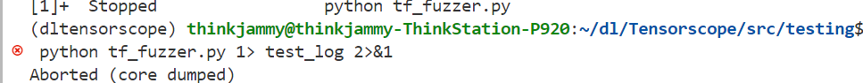
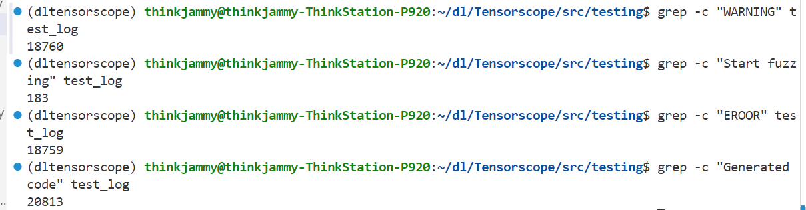
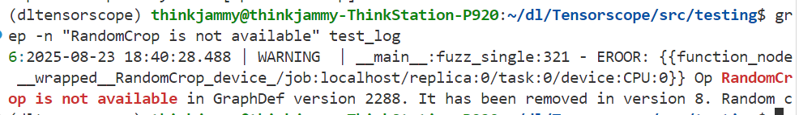
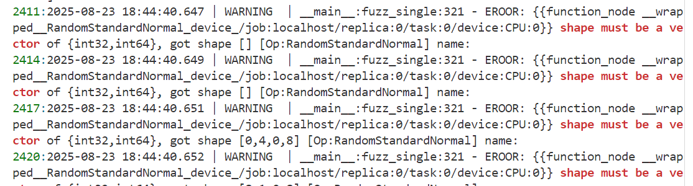
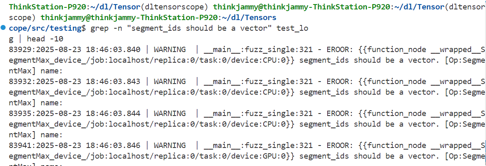
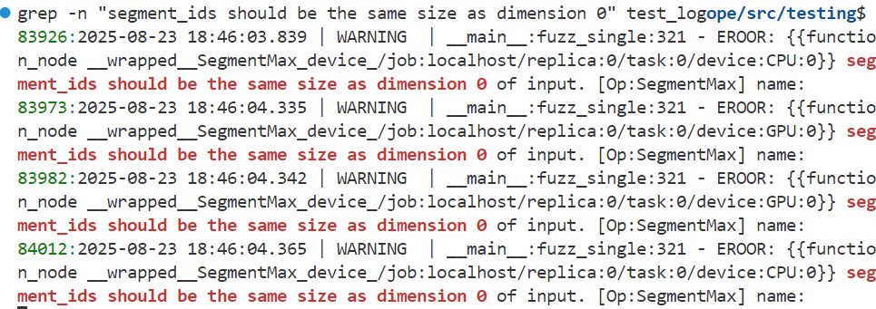
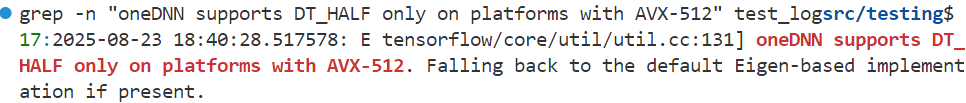
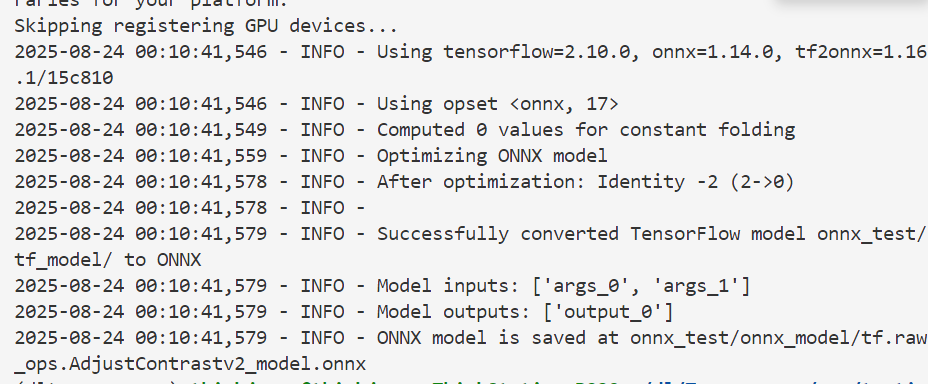
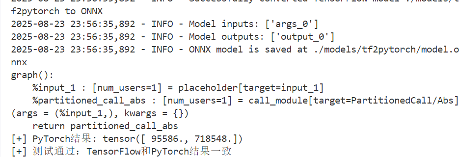
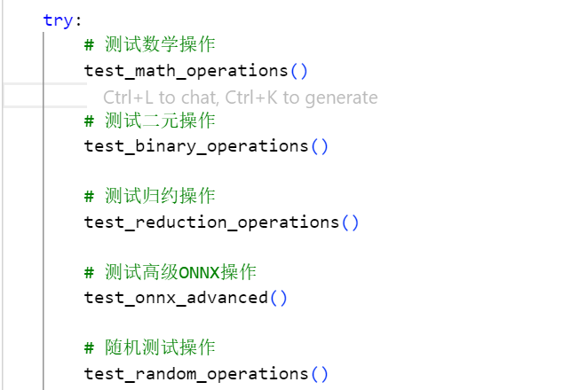

# TENSORSCOPE 阅读记录

## 一、研究背景与问题

### 1. 跨框架部署  
大量使用 TensorFlow ↔ PyTorch ↔ ONNX ↔ TensorFlow Lite 等转换器以实现一次训练、多端部署。  

### 2. 新攻击面出现  
以往对 DL 框架的安全研究主要聚焦单个框架的崩溃或内存漏洞，忽视了"模型在 A 框架正常运行，在 B 框架却精度骤降或行为异常"这类跨框架不一致问题。  

### 3. 面对的三大挑战  
1. 如何自动找出"功能等价"的跨框架 API 对；  
2. 如何精确刻画每个 API 的参数约束；  
3. 如何评估这些不一致在现实模型中的危害。

## 二、TENSORSCOPE 设计概览

论文提出并实现了 TENSORSCOPE，一个全自动的差异测试系统，输入是一组"被认为等价"的跨框架 API，输出是它们的不一致行为及可利用性分析。主要流程如下：

### 1. Counterparts Extraction
- 解析 8 个主流转换器（tf2onnx、onnx2tf、torch.onnx.export 等）的注册表与转换规则，定位 1,658 组跨框架 API。  
 
### 2. Constraint Extraction
- **来源一**：官方 API profile（JSON/YAML）。  
- **来源二**：静态分析源码中的断言（TF 的 OP_REQUIRES、PyTorch 的 TORCH_CHECK 等）。  
- **来源三**：运行时错误信息 

最终提取 17,574 条单参数/多参数约束，比 DocTer 提高 24.7%。  

### 3. Test Case Generation  
- 将多框架共同约束求交集（缩小搜索空间）与求差集（故意触发边界）。  
 
### 4. Testing Optimization（测试优化）  
- **ErrorGuided Fixing**：利用失败日志自动补全约束。  
- **Range Extension**：当覆盖率停滞时，扩大数值/形状/参数范围，再次搜索。  

实验表明两项策略共带来 23 个额外 bug、2.3 万行额外覆盖。

## 三、实验结果

根据实验结果总结如下：

### 1. Bug 分类  
- **崩溃类 177**：段错误 81.9%、浮点异常 7.9%、abort 10.2%。  
- **非崩溃类 80**：
  - 精度 bug（57.5%）  
  - 数据排布 bug（8.7%，如 NHWC vs NCHW）  
  - 特殊值处理差异（33.8%）

### 2. 与现有工具对比  
相对 FreeFuzz 提升 28.7% 覆盖；相对 DocTer 提升 24.3%。

### 3. 真实危害案例  
- tf2onnx 把 uint8 量化算子误转成 float32，导致 MobileNet 在 ImageNet 上的 top1 精度从 72.3% 降到 68.8%，1,741 张图片被误分类，最大置信度下降 0.30。  
- 这些误分类样本在 InceptionV3、EfficientNet 上 93.5% 可迁移，构成新型"框架级对抗样本"。

## 四、方法论贡献

1. **首个系统化的跨框架差异测试框架**。  
2. **联合约束分析**：把"多框架共同接受"与"仅单框架接受"的输入域显式区分开，兼顾深度与广度。  
3. **错误信息驱动 + 范围扩展的双重优化策略**，显著降低无效用例。  
4. **首次定量评估跨框架 bug 的可利用性**，将"模型精度下降"转化为可测量的安全风险。

## 五、局限与未来方向

1. 仅能测试存在"已知转换规则"的 API；对无对应关系的新算子无能为力。  
2. 采样式生成仍面临高维空间爆炸，未来可引入强化学习或符号执行进一步剪枝。  
3. 当前危害分析属于无目标攻击；未来工作将研究"把特定图片误导成指定类别"的目标攻击。

## 六、实验测试

### 1. TensorFlow模糊测试

通过tf_fuzzer.py自动生成测试用例，以此发现API不一致性：

根据测试日志的结果可以得出下面的问题：

#### 1.1 API版本兼容性问题
某些操作在新版本TensorFlow中已被移除或重构,可能导致代码在新版本中无法运行：

#### 1.2 数据类型不匹配
操作期望向量类型的输入，但收到了标量：

#### 1.3 形状约束违反
输入张量的形状不符合操作要求导致运行时形状错误：

#### 1.4 维度不匹配
输入参数之间的维度不匹配：

#### 1.5 硬件兼容性问题
某些数据类型在特定硬件上性能受限，这会导致性能下降，但功能正常：

### 2. 跨框架测试

#### 2.1 ONNX-TensorFlow
验证了TensorFlow的AdjustContrastv2操作符能够正确转换为ONNX格式，使用了64×64×3×2的图像张量和0.53的对比度因子作为输入，TensorFlow原始操作、SavedModel和ONNX模型都能正常执行，转换过程中tf2onnx工具成功将模型优化并减少了2个Identity节点，最终实现了TensorFlow和ONNX之间的结果一致性验证：

#### 2.2 PyTorch-ONNX-TensorFlow
测试从TensorFlow的tf.raw_ops.Abs操作开始，构建了包含随机int32张量输入的模型，通过ONNX模型转换为PyTorch模型，最终在PyTorch中执行相同的操作并验证结果一致性。TensorFlow输出[95586, 718548]，PyTorch输出tensor([95586., 718548.])，数值完全一致（数据类型从int32自动提升为float32），证明了TensorFlow、ONNX和PyTorch三个框架之间的操作兼容性：

为了让结果更加直观，我重新构建了一个测试脚本，测试更多TensorFlow、PyTorch和ONNX之间的操作一致性，主要进行的数学和归约方面的测试：

大部分基础操作（如abs、add、multiply、归约操作等）在TensorFlow和PyTorch之间保持一致，ONNX模型创建和推理也正常工作，但存在两个主要问题：sqrt和log操作在负值输入时产生NaN差异，这可能是不同框架对负数处理策略不同导致的数值精度问题。

详细见fork的仓库：https://github.com/Solar-Lu/Tensorscope