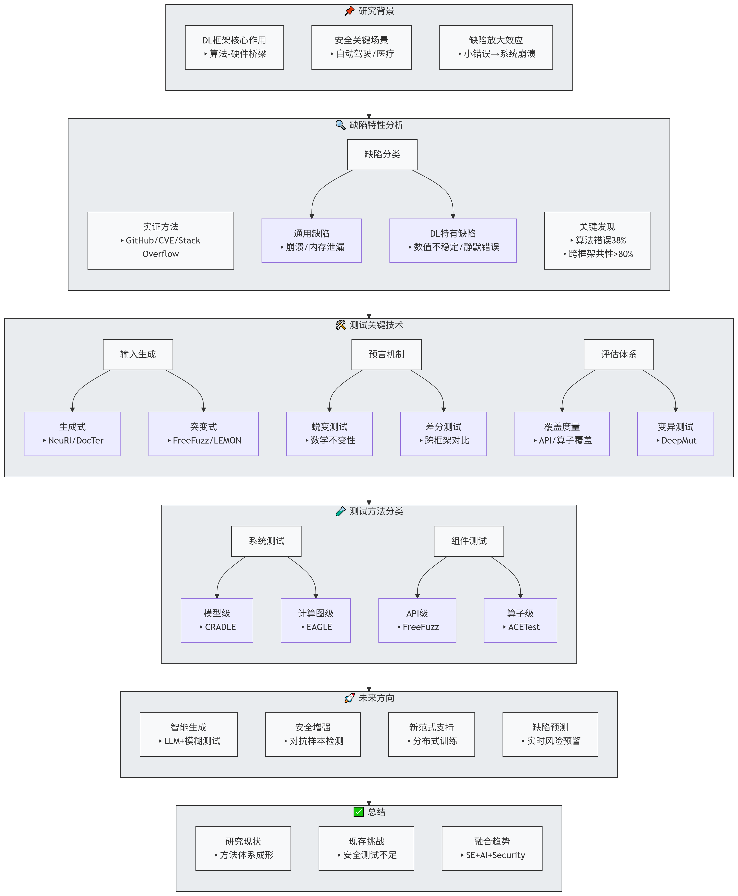

文章作为首篇DL框架测试综述，系统梳理了55篇前沿研究

根据文章思路我绘制了流程图，主要从下面几个方面进行的阐述：

### 一、研究背景

深度学习框架（TensorFlow、PyTorch、MindSpore）作为连接算法与硬件的核心基础软件，其可靠性、安全性与性能直接影响上层应用的安全与稳定。

DL框架的复杂性使其极易引入缺陷，一个微小的实现错误可能导致大规模模型失效，如自动驾驶车辆误判。因此，系统化的测试研究对于保障DL框架质量至关重要。

### 二、核心内容

#### 1. DL框架缺陷特性分析

 实证研究方法：通过GitHub、Stack Overflow和CVE等数据源，对框架缺陷进行抓取、分类和根因分析。

 缺陷的分类，主要分为一般缺陷类别（35%)和特定类别缺陷(65%)

   一般缺陷：包括数据失配、并发错误、内存泄漏、语义逻辑错误等，崩溃是最常见的症状（48.25%）。

   特定缺陷：性能缺陷-内存效率低、数值不稳定-溢出/精度损失、静默缺陷-无报错但结果错误、安全漏洞-如依赖库攻击等。

   文章中提出，算法实现错误是主要根因（占38%），由于隐蔽性高和跨框架的共性导致，并且内存问题导致的老化缺陷占比高达79%。与此同时DL框架的依赖复杂性（如TensorFlow依赖97个Python模块）加剧了安全风险。

#### 2. 测试关键技术

在理解 DL 框架缺陷特性的基础上, 如何高效地生成测试输入,如何判断 DL 框架的输出行为是否符合预期,如何评估测试的质量和效果是DL框架测试流程中主要关注的重点问题。总结如下：

##### 输入生成：

   模糊测试：这是主流方法，分为基于生成（如DocTer利用文档约束生成API参数）和基于突变（如LEMON通过修改模型层结构生成新模型）但是需平衡输入的有效性与覆盖更多场景的挑战。

##### 预言机制：

   蜕变测试：利用数学性质，如Sigmoid(x)+Sigmoid(-x)=1验证该算子的正确性。

   差分测试：对比不同框架/硬件对同一模型的输出差异（如CRADLE提出的输出层间距指标）。

#####  评估体系：

   覆盖度量：提出层类型覆盖、算子级覆盖等新指标，弥补传统代码覆盖的不足。

   变异测试：通过注入缺陷（如数值溢出）评估测试用例的有效性（如DeepMut发现现有测试用例仅能杀死30%变异体）。

#### 3. 测试方法分类

 以DNN模型为输入：CRADLE（差分测试）、LEMON（模型突变）、COMET（覆盖引导生成）。测试框架整体性，但计算成本高，难以覆盖罕见API。

 以计算图为输入：GraphFuzz、EAGLE。聚焦图优化与算子调度缺陷，但需解决图等价性判断难题。

 以特定参数为输入：FreeFuzz（API级模糊测试）、ACETest（算子约束提取）。细粒度检测API/算子缺陷，但难以发现组件交互引发的错误。

### 三、不足与未来方向

#### 1. 现有局限

 输入生成瓶颈：在文章时期LLM的应用尚处早期。

 安全性研究缺失：多数工作聚焦功能缺陷，对对抗攻击、隐私泄露等安全漏洞挖掘不足。

 新一代框架适配性：如分布式训练框架（DeepSpeed）、元算子（JAX）等新特性的测试方法空白。

 缺陷预测滞后：缺乏基于代码提交历史的即时缺陷预测，导致修复成本高。

#### 2. 未来方向

 大模型驱动的测试：利用LLM学习框架约束或历史缺陷模式（如FuzzGPT）。

 安全测试框架：开发针对DL框架的静态分析+模糊测试工具，检测依赖库漏洞或对抗样本风险。

 创新地提出分布式与领域专用框架测试：设计针对分布式通信效率（如梯度同步）、元算子正确性的专项测试方法。

 即时缺陷预测：结合代码特征（如API调用复杂度）与提交历史，实现实时缺陷风险预警。

### 四、总结

就该方向的未来未来需突破传统测试思维，走融合趋势，融合LLM+SE+AI+Security等多学科技术，构建“生成测试修复预测”的闭环体系，最终推动DL框架从“可用”变为“可信”。